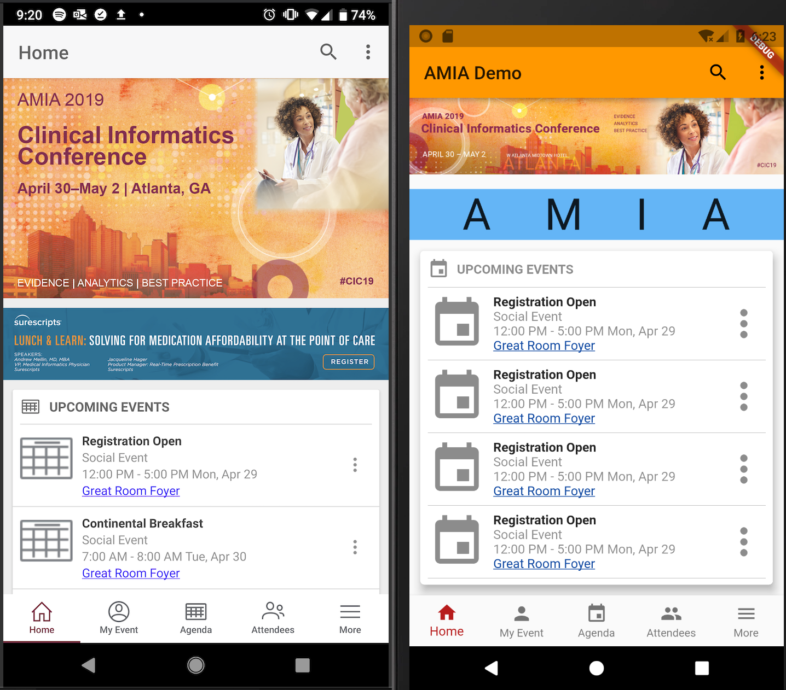

# AMIA Demo

- **What**:  Demo app using Flutter
- **How**: From "hello world" --> a basic mirror of the conference's app
- **When**: Given at AMIA's Clinical Informatics Conference on April 30, 2019 in Atlanta, GA

- **How to use**: 
	- In the top right of this screen
		- Click `Clone or download` in green
		- Make sure you have [Flutter installed](https://flutter.dev/docs/get-started/install). 
	- In your preferred IDE
		- Open the containing folder
		- Go to lib/main.dart 
		- Go to line 16 where it says `home: Home4(),`
		- Change `Home4()` to `Home1()`, `Home2()`, or `Home3()`
	- Hot reload to see what happens
- Follow along with the slides below

## Slides can be found [here](http://bit.ly/amia-flutter)
- [Part 1 - Intro](https://drive.google.com/open?id=10G0DGA1Kts9f7vjEXMJFkpyv3rRHtfCWeFGNe1l0pZg)
- [Part 2 - Beginner](https://drive.google.com/open?id=1Xd1dWVGmQkCYlmVC-V9ra7q62W8bAX1QOmEEwP6QgpI)
- [Part 3 - Intermediate](https://drive.google.com/open?id=1ifw7NwFbAA9gf21SBrgvHrpJlPeq4EjDyfLan6HT0FI) 

<!--stackedit_data:
eyJoaXN0b3J5IjpbLTM5NDI2OTI2MCwtMTI0MTY1ODA2OSwtND
k5NzI5NDkyXX0=
-->